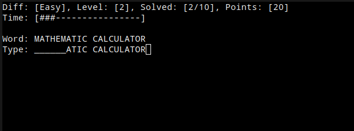

# Typing Game

This is the first computer program I have written from scratch. Before I had written only modifications to existing programs. This is from year 2000 or so. Obviously the code reflects that. Written by a teenager who is just taking his first steps into the world of programming. Back then there were very little resources to help you get started in programming or look up information.

This is a game that tests your typing speed. You have to type the words and sentences before the time runs out. You get points as you go but they are reset to zero if you make a mistake. Very brutal! The game has 3 levels that get progressively more difficult.

The `original` directory contains the source code as originally written. It was made for Windows and compiled using the Borland C++ compiler.

The `remake` directory contains a version that runs on Linux. I made only the minimal changes required to get it to compile and run. Otherwise it is the same code as the original version. I used [this conio.h](https://github.com/zoelabbb/conio.h) as a replacement for the Windows-only header file.

Finding this old code and getting it to run again is a bit of a nostalgia trip for me. Crazy to think that it has been almost 25 years since I wrote this! How the time flies...
